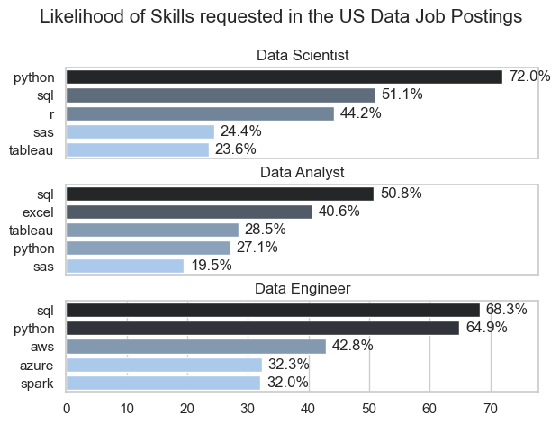
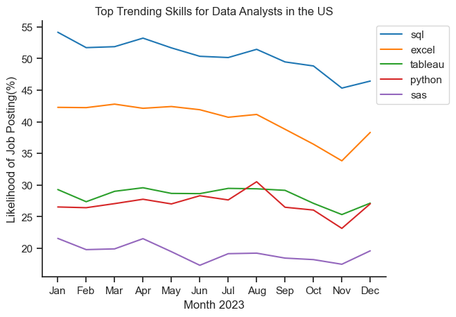
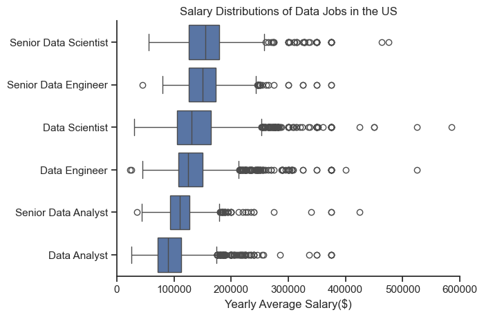
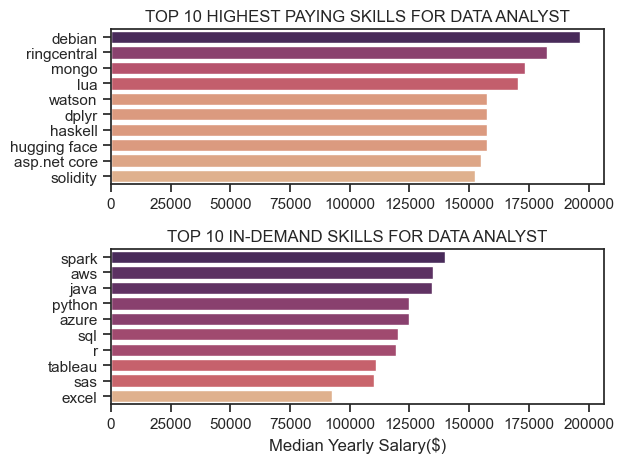
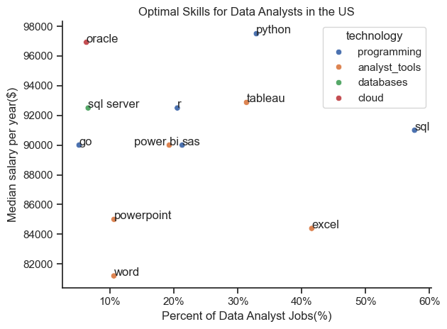

# Introduction
The Datase I used is for the Job market! I specifically focused on Data Analyst roles, exploring problem statements such as Top-paying jobs, Top in-demand skills, and best optimal skills for Data analysts i.e. where high demand meets high salary. 
Furthermore, I decided to focus mostly with the roles being offered in the United states. The data was much more detailed and it was a great comparison to use to better the Data Job market.

Here are the Python code snippets I used to generate my various insights:
[Lead Project](L_Project)


# Background
I was interested in knowing how the job market for Data Analyst looks like in a more consise way. I decided to use this dataset that showcases insights such as job titles, salaries, locations, companies offering them,skills associated with each job posting and more. I got the dataset from a YouTube channel of a data analyst called Lukebarousse.

#### Problem statements I answered using Python
1. What are the most demanded skills for the top 3 most popular data roles in the US?
2. What's the trend of in-demand skills for Data Analysts?
3. How well do jobs and skills pay for Data roles?
4. How do the highest paying skills and the most in-demand skills for Data Analyst compare against each other?
5. What's the optimal skill to learn for a Data Analyst?


# Tools I used
The tools I used to generate my insights for the project include the following:
- **Python**
- **Visual Studio Code**: My ideal code editor for SQL queries
- **Git and GitHub:** Needed a version control to showcase the steps and changes  made as I progressed with my analysis. It's also ideal for sharing and collaboration purposes.

# The Analysis

## 1. What are the most demanded skills for the top 3 most popular data roles in the US?

I decided to filter out the dataset to find out the most in demand positions for Data roles by count and I got the top three. 

Next I proceeded to further filter out the dataset using the skills that are highly demanded for the top 3 positions.
As someone aspiring for a data role, I wanted to educate myself further to know which skills are giong to be demanded most often by future employers.


View my notebook showcasing the steps I took:

[2_Skill_Demand.ipynb](2_Skill_Demand.ipynb)

## You can visualise the data using:

```python
fig, ax = plt.subplots(len(job_titles), 1)

sns.set_theme(style='whitegrid', palette= 'pastel')

for i, job_title in enumerate(job_titles):
    df_plot = df_skills_perc[df_skills_perc['job_title_short'] == job_title].head(5)
    #df_plot.plot(kind= 'barh', x= 'job_skills', y= 'skill_percent', ax=ax[i], title= job_title)
    sns.barplot(data= df_plot,x='skill_percent',y='job_skills', ax=ax[i], hue= 'skill_count', palette='dark:b_r')
    ax[i].set_title(job_title)
    ax[i].set_ylabel('')
    ax[i].set_xlabel('')
    ax[i].legend().set_visible(False)
    ax[i].set_xlim(0,78)
    
    for n, v in enumerate(df_plot['skill_percent']):
        ax[i].text(v +1, n, f'{v:.1f}%', va='center')
   
    if job_title != 'Data Engineer':
        ax[i].set_xticks([])
    
            
    
fig.suptitle('Likelihood of Skills requested in the US Data Job Postings', fontsize= 15)

fig.tight_layout(h_pad=0.5)

plt.show()
```

### Result


*Bar graph visualizing the top in-demand skills for the top 3 Data Roles in 2023.*

### Insights

- Both Data Analyst and Data Scientists have Python and SQL as the most demanded skills for the role but they very between them with Data scientist requiring Python more over SQL i.e. over 72%.

- Data Engineer skills are more specialiszed compared to the two mentioned above with skills such as AWS, Azure and Spark preferred for the role. However, it still has Python and SQL as the most in demand skills.


## 2. What's the trend of in-demand skills for Data Analysts?

Next, I filtered the data to showcase the how popular the top 5 skills for Data Analysts are by comparing the job postings for each skill on a month by month basis for the year 2023 so that I could establish potential trends in the data.

View my notebook showcasing the steps I took:

[3_SkillsTrend.ipynb](3_Skills_Trend.ipynb)

### Visualize the Data

```python

sns.lineplot(data= df_plot, dashes= False, palette= 'tab10')
sns.set_theme(style= 'ticks')
sns.despine()


plt.title('Top Trending Skills for Data Analysts in the US')
plt.xlabel('Month 2023')
plt.ylabel('Likelihood of Job Posting(%)')
plt.legend(loc='upper right', bbox_to_anchor=(1.2, 1))
plt.show()

```

### Results


*Line graph visualizing the top trending skills for Data Analysts in 2023.*

### Insights

- SQL is still consistently the moment demanded skill for Data analyst followed by Excel which still remains a major requirement for employers. Tableau and Python are closely matched to each other with minor fluctuations relative to job postings.


## 3. 
### 3.1 How well do jobs and skills pay for Data roles?

View my notebook showcasing the steps I took:

[4_SalaryAnalysis.ipynb](4_SalaryAnalysis.ipynb)

### Here is an overview of the code used to generate a boxplot showcasing the salary distribution of the top six Data jobs in the US.

``` python
sns.boxplot(data=df_us_6, x='salary_year_avg', y='job_title_short', order= role_order)
sns.set_theme(style='ticks')
sns.despine()

plt.title('Salary Distributions of Data Jobs in the US')
plt.xlabel('Yearly Average Salary($)')
plt.ylabel('')
plt.xlim(0, 600000) 
plt.show()

```

### Results


*Bar graph visualizing the Salary Distribution for Top 6 Data Roles in the US.*

### Insights

- Data analyst roles compared to the other roles have fewer outliers on the higher end indicating a level of consistency in pay while the other roles may vary slightly due to factors such as having more marketable and high-paying skills that can lead to an increased salary bump. The role that showcases this more than any is the Data Scientist role.

- The median salary also increases with seniority and is progressing step by step from Data Analyst to Data Engineer to Data Scientist.

### 3.2 How do the highest paying skills and the most in-demand skills for Data Analyst compare against each other?

#### Here is an overview of the code used to generate a bargraph showcasing the comparison

```python
fig, ax = plt.subplots(2,1)

sns.set_theme(style= 'ticks')

sns.barplot(data=df_us_grp_pay, x='median', y=df_us_grp_pay.index, ax=ax[0], hue= 'median', palette= 'flare')
ax[0].legend().remove()
#df_us_grp_pay[::-1].plot(kind= 'barh',y= 'median', ax=ax[0], legend= False)#[::-1] does the invert yaxis function, same as ax.[0]invert_yaxis() or plt.gca()
ax[0].set_title('TOP 10 HIGHEST PAYING SKILLS FOR DATA ANALYST')
ax[0].set_xlabel('')
ax[0].set_ylabel('')

sns.barplot(data=df_us_grp_skills, x='median', y=df_us_grp_skills.index, ax=ax[1], hue= 'median', palette= 'flare')
ax[1].legend().remove()
#df_us_grp_skills[::-1].plot(kind= 'barh',y= 'median', ax=ax[1], legend= False)
ax[1].set_title('TOP 10 IN-DEMAND SKILLS FOR DATA ANALYST')
ax[1].set_xlim(ax[0].get_xlim())#get the x axis for both graphs to match
ax[1].set_xlabel('Median Yearly Salary($)')
ax[1].set_ylabel('')

fig.tight_layout()
```

### Results


*Bar graph visualizing the highest paying skills for Data analysts compared to the most in-demand skills in the US.*

### Insights

- One of the first insights I gathered is the clear differences in pay between the high paying and the most in-demand skills. In the first graph, debian pays close to 200,000 dollars a year while the highest paying skill for the highly demanded ones is spark whcih is under 140,000 dollars a year.
- Most of the highest paying skills have low demand count and are distributed across different fields such as machine learning, automation, natural languange processing and cloud computing.
- For an aspiring Data analyst who want to growth and develop in their respective field, it's better to focus on the most demanded skills considering that the pay is still high.

## 4. What's the optimal skill to learn for a Data Analyst?

I merged two folders that included the top skills in-demand for Data Analysts as a percentage of the jobs psotings in the market and compared it with their median salary averages which I then plotted on a scatterplot.

There were issues with two of the skills overlapping in the graph so I had to research and find a workaround.

View my notebook showcasing the steps I took:

[5_OptimalSkills.ipynb](5_OptimalSkills.ipynb)

#### Code for the Data visualization

```python
from adjustText import adjust_text

#changed from using matplotlib to seaborn for better visuals and color coding the skills to fit the technology they match to

#df_us_skills_demand.plot(kind= 'scatter', x= 'skill_percent', y= 'median_salary')
sns.scatterplot(data= df_merged, x= 'skill_percent', y= 'median_salary', hue= 'technology')
sns.despine()
sns.set_theme(style='ticks')

plt.title('Optimal Skills for Data Analysts in the US')
plt.xlabel('Percent of Data Analyst Jobs(%)')
plt.ylabel('Median salary per year($)')
plt.tight_layout()


# Function to adjust text positions in the midddle to avoid overlap

def adjust_text_position(x, y, texts, offset=5.5):
    directions = [(offset, 0), (-offset, 0), (0, offset), (0, -offset)]  # Right, Left, Up, Down
    while any((abs(x - tx) < offset and abs(y - ty) < offset) for tx, ty in texts):
        # Try different directions
        for dx, dy in directions:
            new_x = x + dx
            new_y = y + dy
            if not any((abs(new_x - tx) < offset and abs(new_y - ty) < offset) for tx, ty in texts):
                return new_x, new_y
        # If all directions are occupied, increment offset
        offset *= 1.5
    return x, y

# List to store text positions
text_positions = []

# Add text labels with manual adjustment
for i, txt in enumerate(df_us_skills_demand.index):
    x = df_us_skills_demand['skill_percent'].iloc[i]
    y = df_us_skills_demand['median_salary'].iloc[i]
    x, y = adjust_text_position(x, y, text_positions)
    plt.text(x, y, txt)
    text_positions.append((x, y))

#change the numbers in the x axis into percentages
from matplotlib.ticker import PercentFormatter
ax = plt.gca()
ax.xaxis.set_major_formatter(PercentFormatter(xmax=100))

plt.show()
```

### Results


*Scatterplot visualizing the most optimal skill to learn as a Data Analyst.*

### Insights

- First insight that comes out when you see the plot is how many of the skills are related to programming and analytics.

- Most of the programming skills pay much higher as seen from the plot starting at 90,000 dollars and above compared to other skills while Database and cloud skills such as Oracle and SQL server pay very well but are not nearly demanded by employers as per the perccentage of job postings across the Job market

- The most optimal skill to have is python. It is highly demanded when you look at its percentage of Data Analyst jobs that ask for it and it is among the highest paying skills for Data Analyst i.e. close to 98,000 dollars per year as its median salary.


# Conclusions

After dissecting the dataset through SQL and plotting some of my findings using Tableau, I was able to conclude the following:

- Skills associated with Data Analytics: Anyone who wants to start their career in Data Analytics should focus on SQL and Excelas they are the most in-ddemand skills by employers.

- Potential for increased pay: For anyone who is interested in furthering their career in the top 3 Data Jobs, it is important to consider adding more skills to their toolkit as the data shows that the further yo go along to rise to seniority, the more outliers there are in terms of higher pay for each of the three major Data roles.
- Optimal skill: Python leads in this category for anyone aspiring to either start or further their Data Analyst career as it pays considerably well and is higly demanded by employers in the Job market

# What I learned

The project helped me immensely improve my Python skills while at the same time very informative as well. The insights I got helped me to further understand the job market for Data roles across the world not just in the US. I also was able to get very informative potential job portals for accessing employment opportunities in my country, Kenya. 

Furthermore, I also got to see the value of being able to climb the ranks to senior roles such as Senior Data Analyst and Scientist while also understanding the skills I'd need to further my career.
It was a great stepping stone on my path in Data analytics.